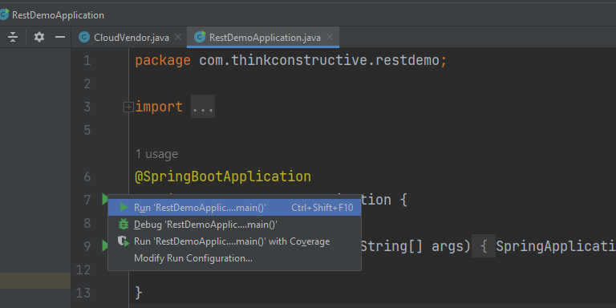

# rest-demo
 
## Running the project
1. Download the maven packages
    - locate the rest-demo project folder, go to .git file folder
      in the file explorer filepath bar 
      - cmd (press Enter)
      - In the command prompt or terminal
        - mvn install
    - Or in intellij
      - Go to pom.xml file and wait for install mvn to appear and click the button to install all dependencies
1. intellij build configuration
- 
- 
  - use openjdk20
3. Every time new path is added the application will need to be stopped and started again
- 
Cheers:)